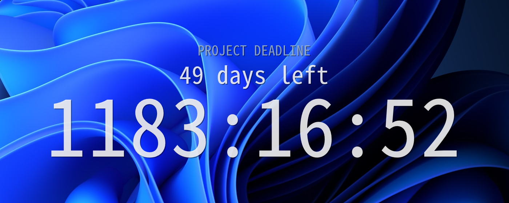

# DesktopCountdown

A countdown that lives on your wallpaper — under the desktop icons, above whatever else is
drawing your background. Windows and macOS.



It does not steal focus, does not sit in a window, and does not cover your background: it is
painted into the wallpaper layer itself, so it survives Explorer restarts and coexists with
animated-wallpaper apps like Wallpaper Engine.

## Features

- **Lines you compose yourself.** The display is a list of lines, each a template string. Put a
  clock, a day count, a caption, or all three — in any order.
- **Tokens.** `{daysTotal} days left`, `D-{daysTotal}`, `{hh}:{mm}:{ss}`, `{months}m {weeks}w
  {days}d` — 13 tokens covering every part of the remaining time.
- **Per-line size, alignment and colour.** Everything else (font, weight, outline, shadow,
  letter spacing, opacity) is shared, so the whole thing stays coherent.
- **Live editing.** A settings window writes `config.toml`; the renderer watches the file and
  repaints within ~0.2 s. Drag a slider and the wallpaper follows it in real time.
- **Multi-monitor.** Every monitor gets the countdown, and any monitor can override the style,
  the position, the line list, or opt out entirely.
- **Font picker that shows the fonts.** Each family name is drawn in its own font, so Korean,
  Chinese and Japanese family names are legible instead of tofu.

## Install

Both builds are on the [latest release](https://github.com/HaJH/DesktopCountdown/releases).

### Windows

Grab `desktop-countdown.exe` and run it. It is a single self-contained binary — the C runtime
is linked statically and everything else it uses (Direct2D, DirectWrite, DirectComposition)
ships with Windows. There is nothing to install and no console window; look for the tray icon.

### macOS 11+

Grab `DesktopCountdown-macos-universal.zip` (Apple silicon and Intel in one binary), unzip it,
and move `DesktopCountdown.app` to `/Applications`. Look for the icon in the menu bar — if the
bar is crowded, macOS may push it off the end, so make room before deciding it did not start.

**The app is not notarized, so macOS will refuse to open it the first time.** Signing up for
notarization costs $99 a year, which is not worth it for this. Two ways past it:

The fast way — strip the quarantine flag the browser attached, then open it normally:

```sh
xattr -dr com.apple.quarantine /Applications/DesktopCountdown.app
```

Or download it with `curl`, which never attaches the flag in the first place, and it just opens:

```sh
curl -L -o dc.zip https://github.com/HaJH/DesktopCountdown/releases/latest/download/DesktopCountdown-macos-universal.zip
```

The GUI way — double-click the app, let it be blocked, then go to **System Settings → Privacy
& Security**, scroll to the bottom, and click **Open Anyway** next to the message about
DesktopCountdown. (Control-clicking the app and choosing Open used to work; macOS 15 removed
that shortcut.)

### From source

You need [Rust](https://rustup.rs) (1.92+).

```
cargo build --release
```

The result is `target/release/desktop-countdown` (`.exe` on Windows; `build.bat` does the same
and can be double-clicked). A `cargo run` on macOS behaves like the bundled app — it sets the
same accessory activation policy at runtime — so there is no need to build a bundle to try it.

| Command | What it does |
|---|---|
| `desktop-countdown` | Draws the countdown. Use the tray / menu bar icon for the menu. |
| `desktop-countdown --settings` | Opens the settings window. |

## Configuration

Click the tray / menu bar icon → **Open settings** for the GUI. Every change is saved
automatically and shows up on the wallpaper right away. You can also edit the file by hand; it
is re-read about 100 ms after you save it.

| | Config | Log |
|---|---|---|
| Windows | `%APPDATA%\DesktopCountdown\config.toml` | `%LOCALAPPDATA%\DesktopCountdown\log.txt` |
| macOS | `~/Library/Application Support/DesktopCountdown/config.toml` | `~/Library/Logs/DesktopCountdown/log.txt` |

### Lines and tokens

The display is a stack of lines, top to bottom. Each line's `text` is a template. `size_ratio`
multiplies the base `[style].size_px`, and a line without a `color` inherits `[style].color`.

```toml
target = "2026-12-31T23:59:59"

[style]
font_family = "Consolas"
size_px = 64.0            # the base size that every size_ratio multiplies
color = "#FFFFFF"

[[line]]
text = "PROJECT DEADLINE"
size_ratio = 0.17
color = "#9FB4C7"

[[line]]
text = "{daysTotal} days left"
size_ratio = 0.3

[[line]]
text = "{hh}:{mm}:{ss}"
size_ratio = 1.0
align = "center"          # left | center | right
```

Available tokens:

| Token | Meaning |
|---|---|
| `{months}` `{weeks}` `{days}` | Calendar months, then whole weeks, then whole days |
| `{daysTotal}` `{hoursTotal}` `{minutesTotal}` `{secondsTotal}` | Total time remaining, in that unit |
| `{hours}` `{minutes}` `{seconds}` | Hours within the day (0–23), minutes, seconds |
| `{hh}` `{mm}` `{ss}` | Zero-padded to two digits (`{hh}` is the *total* hours, so it grows past two) |

An unknown token is printed as-is, so a typo shows on the wallpaper instead of vanishing
silently.

The settings window ships presets — Clock only, Summary + Clock, D-Day, Days left,
Caption + Clock — that replace the whole look, lines and style together, in one click. A fresh
config starts on Clock only: `{hh}:{mm}:{ss}` on its own.

Picking a preset applies it straight away. Editing on top of it does not touch the preset — the
picker just marks the look as changed (`Clock only *`), and `Reset` puts it back. `Save as…`
stores the current lines and style under a name of your own, so switching presets never costs
you a look you cared to keep; a preset you saved can be deleted again, which drops the name and
leaves the wallpaper as it is.

Your own presets live in `presets.toml`, next to `config.toml`. The renderer never reads that
file: the preset library stays out of the config the countdown is drawn from, however long it
grows. You can write presets into it by hand. One that names a value the renderer would refuse,
or that takes a name already spoken for, is left out of the picker — but it is left in the file,
not deleted, so a preset you wrote is never lost to a preset you save.

`config.toml` also carries a `preset` key naming which preset is active. That is bookkeeping for
the settings window only — the renderer ignores it and draws from `[style]` and `[[line]]`
alone — so there is no need to set it by hand. If it is missing, or names a preset that no
longer exists, the settings window recovers the label by matching your lines and style against
the presets it knows, rather than showing `Custom` for no reason.

### Per-monitor overrides

The settings window has a tab per monitor. Turning on the override copies the current global
settings so you tweak from what you see. By hand, it is a `[[display]]` block:

```toml
[[display]]
id = "\\\\?\\DISPLAY#DEL41A8#1"
name = "DISPLAY1"
enabled = true
anchor = "top-center"
size_px = 48.0

[[display.line]]
text = "D-{daysTotal}"
```

A monitor's line list replaces the global one wholesale. `enabled = false` hides the countdown
on that monitor.

A bad config is not applied: the previous one stays, the tray icon shows a warning, and the
reason is written to the log file above.

## How it works

The two systems reach the wallpaper layer by completely different routes, so the app has a
backend for each (`src/platform/`). Everything above them — the config, the tokens, the layout,
the settings window — is shared.

**Windows** draws the wallpaper in a `WorkerW` window that sits below the desktop icons. The
app finds that window (sending the undocumented `0x052C` message to `Progman` when it has to),
creates a child of it, and composes a per-pixel-alpha visual onto it with DirectComposition.
`UpdateLayeredWindow` is the obvious approach and does not work here — it returns `Ok` from a
child window and draws nothing, which a spike confirmed
(`docs/superpowers/plans/spike-result.md`).

**macOS** has no wallpaper window to find. A borderless `NSWindow` one level below
`kCGDesktopIconWindowLevel` *is* the wallpaper layer: it sits under the icons, ignores the
mouse, follows you across Spaces, and stays out of Mission Control, the Dock and Cmd-Tab. The
whole re-attach-with-backoff dance the Windows backend needs simply does not exist here
(`docs/superpowers/plans/macos-spike-result.md`).

The text is DirectWrite on one side and CoreText on the other, but the same idea on both: glyph
outlines, measured by their *ink* rather than their line boxes, so the gap between lines is the
gap you asked for in any font — including CJK fonts, whose ascent is sized for Hangul while a
countdown only ever draws digits.

## Known limitations

- The countdown is part of the wallpaper, so you cannot click it. Everything is driven from the
  tray / menu bar icon and the settings window.
- **Windows:** attaching to the wallpaper layer relies on undocumented behaviour. It
  re-attaches by itself when Explorer restarts, but a future Windows update could change the
  window structure and break it.
- **macOS:** the app is not notarized, so the first launch needs the workaround above. Sizes in
  `config.toml` are points on macOS and physical pixels on Windows — the same number looks about
  the same on a normal display, and stays crisp instead of doubling on a Retina one, but a
  config shared between the two is not pixel-for-pixel identical.
- **macOS:** per-monitor overrides are keyed on the display's UUID, and Windows keys them on its
  own device name. A `config.toml` shared between the two applies its global settings on both;
  only the per-monitor overrides go unmatched on the other system.
- At the target time the countdown stops at `00:00:00`. It does not count up and does not
  notify.
- **Upgrading a `config.toml` from before lines were configurable:** if it has no `[[line]]`
  section, one is filled in for you — but always with Clock only, even if the old file had
  `show_summary_line = true`. That flag no longer decides anything, so the summary line does
  not carry over automatically; pick **Summary + Clock** in the settings window afterwards if
  you want it back.

## Documentation

Design documents and implementation plans live in `docs/` (in Korean). They record the
non-obvious decisions — why DirectComposition, how the wallpaper window is found, how the line
list replaced the old fixed two-line layout.

## Licence

MIT. See [LICENSE](LICENSE).
